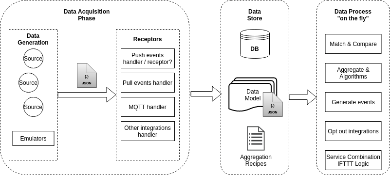
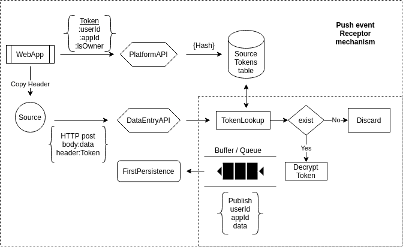

# Data Integration Platform

Dip, is a platform designed for data integrations from different sources.
For the time being, the platform supports 2 kinds of mechanisms to integrate
new sources. The push mechanism and the pull mechanism and only for the http
protocol but the plan is to expand this to other protocols and technologies
as well.

The platform's functionalities are developed in a micro-services model

### Push Mechanism

