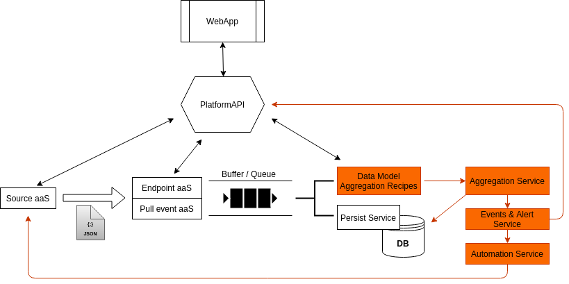
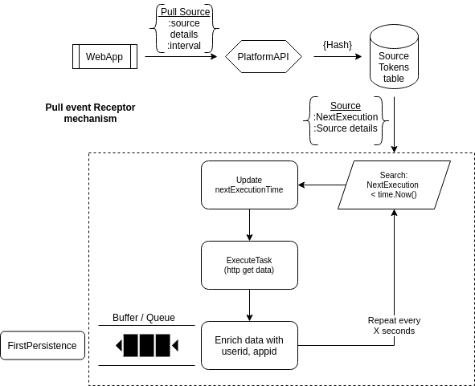

# D.I.P. (Data Integration Platform)

_The project is under construction. Only finished the first phase, that is about the data 
acquisition._

Dip, is a platform designed for data integrations from different sources. It's fast 
and handy when it comes to IoT applications, that you have more than 1 technologies 
and domains for incoming data and you want to store and process them all in 1 place.

The platform's functionalities are developed in a micro-services model. As it is 
structured, for future functionalities (orange), the user will be able to create
recipes full of aggregation rules and event generation strategies. At the moment, 
the services that are already implemented, are about the data acquisition, the raw
data persistence and a first version of the  Platform API for the resource management 

## Basic concepts
For better understanding of the platform, a summary table of basic resources follows

|resource|description|
|--------|-----------|
|application|Umbrella resource that contains the information about sources, storages, integrations etc. For better use, all the sources should be relevant to each other.|
|source token|Used by the push mechanism as a tool for authentication of the sources|
|pull source task|Used by the pull mechanism. Includes all the necessary information about the source and the time period of execution.|
|storage|A selected place where the data is stored. At the moment, it represents a mongo collection, but it could be a different db, a file, etc.|
## Data Acquisition

At the moment, the platform supports 2 kinds of mechanisms to integrate
new sources. The push mechanism and the pull mechanism and only for the http
protocol but the goal is to expand this to other protocols and technologies
as well.

### Push Mechanism

This is ideal for sources that uses http integrations as an option out for their data. 
Most of the time, all the IoT technologies uses a network and application stack as
their first level of data handling that depend on each technology. Http post call,
is the most common option for integration on their application server. 

For the push mechanism, the user must create through the platformAPI a source token 
and then place it as a header on the source as `source-token:token`. The token contains
all the information about the application and the owner so when the source send the
data, there will be a match. 

The source can send the data through the DataEntryApi service with a http post 
at the `/data` endpoint. After the lookup and match procedure at server side, it
depends on the application if the raw data is stored or not

### Pull Mechanism

This is ideal for sources like other api's, health-check mechanisms etc. The user 
must add the information about the source and a time period of usage through the 
PlatformAPI. Then, a separate procedure will constantly search for tasks that need
to be executed based on their time period and last execution time. If it finds any,
will execute it and drive the response data to the persistence service to store them.

